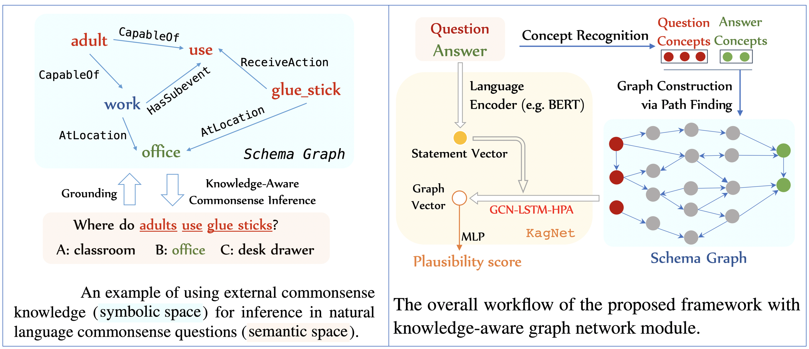
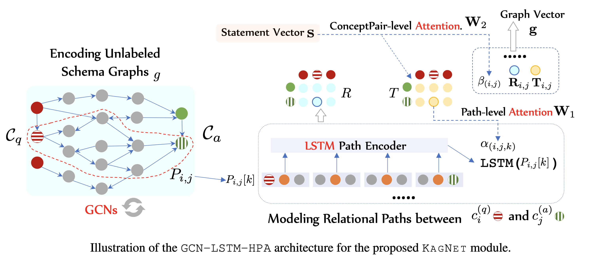

# KagNet: Knowledge-Aware Graph Networks
 
_**News:**_
We released a more general-purpose LM-GNN reasoning framework, [MHGRN](https://github.com/INK-USC/MHGRN), which includes more options for text/graph encoders. It also matches the current state-of-the-art performance (76.5% acc) on the offical CommonsenseQA test set. We won't maintain this repo, so please follow the new repo.
 
### Introduction
This codebase is an implementation of the proposed KagNet model for commonsense reasoning (EMNLP-IJCNLP 2019). 


- Overall Workflow

- GCN + LSTM-based Path Encoder + Hierarchical Path Attention

 
 
### Install Dependencies 

```
sudo apt-get install graphviz libgraphviz-dev pkg-config
conda create -n kagnet_test python==3.6.3
conda activate kagnet_test
# which python
# which pip
pip install torch torchvision 
pip install tensorflow-gpu==1.10.0
conda install faiss-gpu cudatoolkit=10.0 -c pytorch -n kagnet_test 
pip install nltk
conda install -c conda-forge spacy -n kagnet_test
python -m spacy download en
pip install jsbeautifier
pip install networkx
pip install dgl
pip install pygraphviz
pip install allennlp
```

#### Datasets downloading
```

cd datasets
mkdir csqa_new

wget -P csqa_new https://s3.amazonaws.com/commensenseqa/train_rand_split.jsonl
wget -P csqa_new https://s3.amazonaws.com/commensenseqa/dev_rand_split.jsonl 
wget -P csqa_new https://s3.amazonaws.com/commensenseqa/test_rand_split_no_answers.jsonl


python convert_csqa.py csqa_new/train_rand_split.jsonl csqa_new/train_rand_split.jsonl.statements
python convert_csqa.py csqa_new/dev_rand_split.jsonl csqa_new/dev_rand_split.jsonl.statements
python convert_csqa.py csqa_new/test_rand_split_no_answers.jsonl csqa_new/test_rand_split_no_answers.jsonl.statements
```

### Preprocess ConceptNet and embedding files
```
cd ../conceptnet
wget https://s3.amazonaws.com/conceptnet/downloads/2018/edges/conceptnet-assertions-5.6.0.csv.gz
gzip -d conceptnet-assertions-5.6.0.csv.gz
python extract_cpnet.py


cd ../triple_string
python triple_string_generation.py

# get concept and relation embeddings with frequency and vocab files
cd ../embeddings/
cd glove/
wget http://nlp.stanford.edu/data/glove.6B.zip
unzip glove.6B.zip
rm glove.*.zip
cd ../
python glove_to_npy.py  
python create_embeddings_glove.py
```

### Concept Grounding
```
# concept grounding: core concept recognition (find mentioned concepts)
 
cd ../grounding/
python batched_grounding.py generate_bash "../datasets/csqa_new/train_rand_split.jsonl.statements"
bash cmd.sh
python batched_grounding.py combine "../datasets/csqa_new/train_rand_split.jsonl.statements"
python prune_qc.py ../datasets/csqa_new/train_rand_split.jsonl.statements.mcp

python batched_grounding.py generate_bash "../datasets/csqa_new/dev_rand_split.jsonl.statements"
bash cmd.sh
python batched_grounding.py combine "../datasets/csqa_new/dev_rand_split.jsonl.statements"
python prune_qc.py ../datasets/csqa_new/dev_rand_split.jsonl.statements.mcp

# python batched_grounding.py generate_bash "../datasets/csqa_new/test_rand_split.jsonl.statements"
# bash cmd.sh
# python batched_grounding.py combine "../datasets/csqa_new/test_rand_split.jsonl.statements"
```

#### Schema Graph Construction
```
cd ../pathfinder/
python graph_construction.py

python batched_pathfinding.py generate_bash "../datasets/csqa_new/train_rand_split.jsonl.statements.mcp"
bash cmd.sh
python batched_pathfinding.py combine "../datasets/csqa_new/train_rand_split.jsonl.statements.mcp"

python batched_pathfinding.py generate_bash "../datasets/csqa_new/dev_rand_split.jsonl.statements.mcp"
bash cmd.sh
python batched_pathfinding.py combine "../datasets/csqa_new/dev_rand_split.jsonl.statements.mcp"

# Pruning 

python path_scoring.py train
python path_scoring.py dev

python path_pruning.py train
python path_pruning.py dev

cd ../graph_generation
python graph_gen.py train
python graph_gen.py test
```

### Train KagNet based on extracted BERT embeddings
```
cd ../baselines/

bash train_csqa_bert.sh
python extract_csqa_bert.py --bert_model bert-large-uncased --do_eval --do_lower_case --data_dir ../datasets/csqa_new --eval_batch_size 60 --learning_rate 1e-4  --max_seq_length 70 --mlp_hidden_dim 16 --output_dir ./models/ --save_model_name bert_large_b60g4lr1e-4wd0.01wp0.1_1337 --epoch_id 1 --data_split_to_extract train_rand_split.jsonl --output_sentvec_file ../datasets/csqa_new/train_rand_split.jsonl.statements.finetuned.large --layer_id -1 
python extract_csqa_bert.py --bert_model bert-large-uncased --do_eval --do_lower_case --data_dir ../datasets/csqa_new --eval_batch_size 60 --learning_rate 1e-4  --max_seq_length 70 --mlp_hidden_dim 16 --output_dir ./models/ --save_model_name bert_large_b60g4lr1e-4wd0.01wp0.1_1337 --epoch_id 1 --data_split_to_extract dev_rand_split.jsonl --output_sentvec_file ../datasets/csqa_new/dev_rand_split.jsonl.statements.finetuned.large --layer_id -1

cd ../models/
python main.py

```

### Citation
```
@inproceedings{kagnet-emnlp19,
  author    = {Bill Yuchen Lin and Xinyue Chen and Jamin Chen and Xiang Ren},
  title     = {KagNet: Knowledge-Aware Graph Networks for Commonsense Reasoning.},
  booktitle = {Proceedings of EMNLP-IJCNLP},
  year      = {2019},
}
``` 
#### Remarks
Feel free to email yuchen[dot]lin[at]usc[dot]edu if you have any questions and need help.

